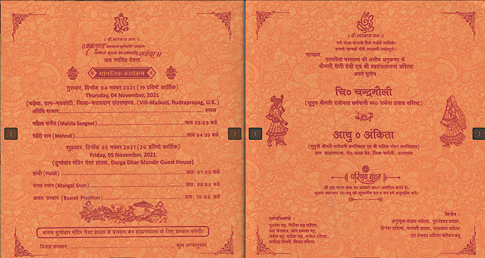

<p align="center"><a href="https://chandramouli-ankita.netlify.app/"></a></p>
<h1 align="center"><a href="https://chandramouli-ankita.netlify.app/">Wedding Invitation</a> :ring: <br> <br> SAVE THE DATE: NOV 05, 2021 <br> <a href="https://chandramouli-ankita.netlify.app/">sonali.netlify.app</a></h1>

[](https://github.com/vinitshahdeo/Wedding-Invitation)

## Wedding Invitation :ring:

<details>
  <summary><strong>View Invitation</strong></summary>
  <a href="https://chandramouli-ankita.netlify.app/"></a>
</details>

With the divine grace of Shri Ganesha,
inviting you and your family to younger brother's wedding to be held on **05 November at my home in [Village Maikoti](https://goo.gl/maps/4LFU54ueypeJ1xk99)

- [Download](https://github.com/vashisthg/Wedding-Invitation/raw/master/docs/Chandramouli-Wedding-Invitation.pdf) the Invitation card

- Find [Village Maikoti](https://goo.gl/maps/4LFU54ueypeJ1xk99) on Google map

- Visit the [website](https://chandramouli-ankita.netlify.app) for more details


```js

const newCouple = 'Chandramouli & Ankita';

// Nov 05, 2021
const weddingDate = new Date(2021, 11, 05);

const weddingVenue = new Location('Chadetha, Maikoti');

(function() {
    newCouple.willTieKnot(weddingDate);

    // your presence is requested
    (new Wedding()).acceptInvitation(
        window.open('https://chandramouli-ankita.netlify.app/')
    );
})();


```

## Are you or your loved ones a *bride-to-be* or *groom-to-be*? 
> Feel free to use this template to build your wedding website!

To reuse this, follow the steps:

- *Replace the date in [script.js](https://github.com/vinitshahdeo/Wedding-Invitation/blob/master/js/script.js#L29) to have a timer running for your big day!*

```js
// Set the date we're counting down to
var countDownDate = new Date("Nov 29, 2020 00:00:00").getTime();
```
